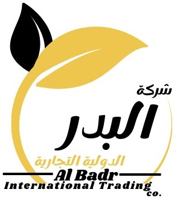

# شركة البدر الدولية التجارية | Al-Badr International Trading Company



## نبذة عن الشركة | About the Company

**العربية:**
نحن شركة البدر الدولية التجارية، متخصصون في استيراد وتوزيع أجود أنواع العصائر والمشروبات المعبأة. نقدم منتجات ذات جودة عالية تناسب جميع الأذواق والمناسبات، مع التزامنا بتقديم خدمة عملاء ممتازة وتوصيل سريع.

**English:**
We are Al-Badr International Trading Company, specializing in importing and distributing the finest juices and packaged beverages. We offer high-quality products suitable for all tastes and occasions, with our commitment to providing excellent customer service and fast delivery.

## المنتجات | Products

### عصائر توب ماكس | Top Max Juices
- برتقال توب ماكس (1 لتر)
- مانجو توب ماكس (1 لتر)
- تفاح توب ماكس (1 لتر)

### عصائر كادي | Cady Juices
- تفاح كادي عادي (200 مل)
- برتقال كادي (200 مل)
- مشكل كادي نكتار (200 مل)

## المميزات | Features

✅ **جودة عالية** - منتجات مستوردة بأعلى معايير الجودة  
✅ **توصيل سريع** - خدمة توصيل فعالة في جميع أنحاء المملكة  
✅ **خدمة عملاء ممتازة** - فريق متخصص للرد على استفساراتكم  
✅ **أسعار تنافسية** - أفضل الأسعار في السوق  

## التقنيات المستخدمة | Technologies Used

- **React** - مكتبة JavaScript لبناء واجهات المستخدم
- **TypeScript** - لكتابة كود آمن ومنظم
- **Tailwind CSS** - لتصميم واجهة مستخدم جميلة ومتجاوبة
- **Vite** - أداة بناء سريعة للتطوير
- **shadcn/ui** - مكونات واجهة مستخدم حديثة
- **React Router** - للتنقل بين الصفحات
- **Lucide React** - أيقونات جميلة ومتجاوبة

## التثبيت والتشغيل | Installation & Setup

### المتطلبات | Prerequisites
- Node.js (الإصدار 16 أو أحدث)
- npm أو yarn

### خطوات التثبيت | Installation Steps

```bash
# استنساخ المشروع
git clone <repository-url>

# الانتقال إلى مجلد المشروع
cd bader-drinkshop

# تثبيت التبعيات
npm install

# تشغيل المشروع في وضع التطوير
npm run dev

# بناء المشروع للإنتاج
npm run build
```

## هيكل المشروع | Project Structure

```
src/
├── components/         # المكونات المعاد استخدامها
│   ├── ui/            # مكونات واجهة المستخدم الأساسية
│   ├── Header.tsx     # رأس الصفحة
│   ├── Footer.tsx     # تذييل الصفحة
│   ├── ProductCard.tsx # بطاقة المنتج
│   └── ...
├── pages/             # صفحات التطبيق
│   ├── Index.tsx      # الصفحة الرئيسية
│   ├── Products.tsx   # صفحة المنتجات
│   ├── About.tsx      # صفحة من نحن
│   └── Contact.tsx    # صفحة اتصل بنا
├── data/              # بيانات المنتجات
├── contexts/          # React Contexts
└── hooks/             # React Hooks المخصصة
```

## الصفحات | Pages

- **الرئيسية** - عرض المنتجات المميزة ومعلومات الشركة
- **المنتجات** - عرض جميع المنتجات مع إمكانية البحث والفلترة
- **من نحن** - معلومات عن الشركة ورؤيتها
- **اتصل بنا** - معلومات التواصل ونموذج الاستفسار

## التواصل | Contact

📱 **واتساب:** +966 53 448 8744  
📧 **البريد الإلكتروني:** info@albadr-trading.com  
🌐 **الموقع الإلكتروني:** [www.albadr-trading.com](https://www.albadr-trading.com)  

## الترخيص | License

هذا المشروع محمي بحقوق الطبع والنشر لشركة البدر الدولية التجارية.  
This project is copyrighted by Al-Badr International Trading Company.

## المساهمة | Contributing

نحن نرحب بالمساهمات! يرجى قراءة دليل المساهمة قبل إرسال طلبات السحب.  
We welcome contributions! Please read the contributing guide before submitting pull requests.

## الدعم | Support

إذا واجهت أي مشاكل أو لديك استفسارات، يرجى التواصل معنا عبر:  
If you encounter any issues or have questions, please contact us via:

- فتح issue جديد في GitHub
- التواصل معنا عبر الواتساب
- إرسال بريد إلكتروني

---

**تم التطوير بواسطة:** فريق التطوير في شركة البدر الدولية التجارية  
**Developed by:** Al-Badr International Trading Company Development Team

© 2024 شركة البدر الدولية التجارية. جميع الحقوق محفوظة.
